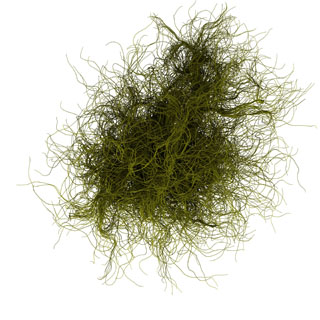

# Generative Art

I've always been fascinated by generative art, aka procedural art.  Generative art is art that in whole or in part is created algorithmically.  My earliest efforts were on my first computer, an Apple ][+.  Things really got started once I got a PC and wrote my ray tracer, Vivid.  Here's the first image I publicly shared from Vivid:

Ray traced images are known for their accurate calculation of shadow, reflection, and refraction.

> Historical aside: Vivid was instrumental in my meeting Lili.  When I wrote Vivid, I was working at Boeing.  I had been reading a lot about graphics and wanted a testbed to experiment with some ideas.  This led to writing Vivid.  After getting some positive feedback showing off the images on local BBSs and CompuServe (yes, before the web ruled the earth) I decided to release Vivid as a shareware product.  Much polishing and documenting later and it was released.  One day I received a call from a guy who liked Vivid and wanted to talk about collaborating in some way.  He had previously co-authored some computer graphics books which I had actually read.  They weren't that good. I told him what I thought and he agreed and asked if I could do better.  Two weeks later he called back and said that we had an contract offer from M&T Publishing to do a book on ray tracing.  A year later I was a published author.    Back in the day, Tower Books in downtown Bellevue had the best computer science section in the state.  You want SIGGRAPH Proceedings from 7 years ago?  Yep, they had it.  Before Amazon, this was the only place to go.  One evening, my cubicle mate form Boeing was hanging out at Tower and noticed a guy buying every graphics book he could find.  He struck up a conversation and recommended my book.  Sadly(?), the book was currently sold out so the guy buying the books gave my co-worker his card to pass on to me.  "Have Stephen give me a call."  The man turned out to be David Norris, a long time Microsoftie who was putting together a graphics group.  We chatted on the phone, which led to an informational interview, a real interview, and a job offer.    The org I hired into was called Advanced Computer Technology and had a diverse set of groups working within it.  One thing common to all was that they were growing rapidly.  At one point I was asked to do an interview for a sibling team which was looking for a developer that had good graphics knowledge.  The manager of the team, Linda Stone, liked my interview feedback.  She felt like I grokked what kind of person she was looking for so I became a regular fixture on her interview loops.  At the time, Lili worked on her team and this was how we met.  It would be another dozen years or so before we actually worked together.  And yes, that story also involves software I wrote just for fun.

In addition to generative art I'm also a fan of woodblock prints.  At one point I decided to try and copy the typical style of woodblock shading with code.  Here's an example print showing what I was trying to achieve:

The solution turned out be be easier than I originally expected.  Here's the test scene that I was using rendered with simple lighting and soft shadows.

I think created procedural textures for each of the surfaces.  The texture is a simple triangle wave ramping between black and white.  (This one also has shading on it but I couldn't find one without.  :-)

These are then combined.  For each pixel, the brightness of the lit image is compared to the brightness of the textured one.  If the lit image is lighter then the resulting pixels is white.  If the lit image is darker, the result is black.

Here's another image done with the same technique.

# Lots of Spheres

  
  
  While working on Vivid I was constantly trying to improve the render times.  In a naive ray tracer, each ray must be test against every object in the scene. This can be brutally slow.  To speed things up most ray tracers use some kind of hierarchical bounding scheme. At one point I created the image to the right to stress test my bounding hierarchy scheme.  The image is composed of over 10 million spheres.  To define the layout of the spheres I created a particle system and placed spheres along the particles' paths.  The paths are affected by gravity, a twisting force, and a turbulence force defined using multiple octaves of Perlin Noise.  The RGB values which define the color of each particle were picked based on the initial XYZ velocity of each particle.  This means that particles which start off moving in similar directions have similar colors.  
  Click on the image to see the full size version where you can actually see the individual spheres.

This image got me started with doing a bunch more particle system / sphere images.  Here are some samples.  Click through for the full size versions. 

# Not So Many Spheres
While the previous images had hundreds of thousands to millions of spheres in them, the next set of images just have three spheres each.  Two smaller, slightly reflective, colored spheres are positioned within a single larger mirrored sphere.  The viewpoint is also contained within the larger sphere.  Because the spheres are mirrored the resulting images have layers and layers of blended reflections. 

# Just Random
Sometimes it's interesting to randomly replicate a shape a bunch of times.  For instance, the following is composed of randomly shaped blocks set on a plane.  The result strongly suggests a cityscape. 
 
Change the common plane from a base to a midline and things become more abstract. 

 
Or stick with cubes but wrap them around a sphere. I love the texture that results as the density of the cubes increases. 

 
Here I've just confined the positioning to an roughly cubical volume in space while keeping the boxes axis aligned.  The first image brings to mind Brutalist architecture.  Ok, the grey-scale rendering kind of pushes it in that direction, too.  In the second image I've constrain the boxes to have one dimension much smaller than the other two.  Now I see walls and floors for an abstract platformer game. 

# Do It Yourself!
If you're interested in experimenting with generative art a great place to start would be to give Processing a try.  Processing is a free, open source tool designed with generative art in mind.  It's simple enough to be picked up by non-coders but deep enough to be endlessly interesting.
[Go here to learn more and get Processing.](https://processing.org/)

