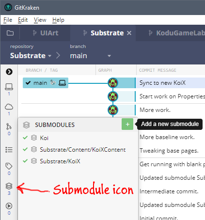
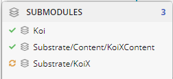
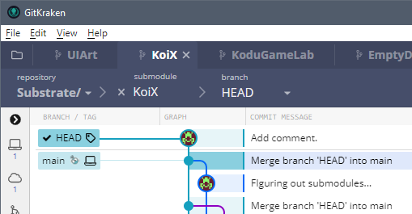
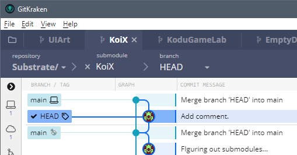
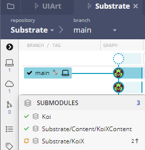
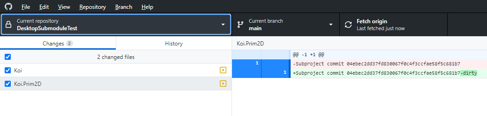

# Working with SubModules in GitKraken

First of all, why are we doing this at all?  If we just include the libraries in the project then the changes to the libraries will affect all projects that use the libraries.  This means that any change to a library and break multiple projects.

The purpose of the submodules is to make using shared libraries a good thing while not forcing all applications to always take the latest changes.  Local changes can still be committed.  These only affect the single application until they are pushed up to GitHub.  At that point they still don't affect other applications until you pull those changes.

Overall the process is kind of complex and error prone but it does makes things more flexible.  Is it worth it?  We'll see.

These notes are good but need to have more info regarding how this all works in both Git, GitKraken, and VS.

## Adding a SubModule
- Click on the submodule icon on the left side menu.
- Click on the '+' in the upper right to add new submodule.<br>


## Changing Submodule files locally
- Change file and save to disk.  Here I've changed a file in KoiX.  Note the "recycle" icon in orange.  This indicates the submodule has changes.<br>


## Committing local changes
- Right click on the **...** menu next to the submodule name and select **Open this submodule**.
- Stage and commit changes.  Note that this leaves the submodule in a "detached head" state.<br>

- Right click on "main" and choose **Merge HEAD into main**.<br>


## Pushing back to GitHub
- Look at the above image.  One way to get the changes back to GitHub is to right click on origin/main (the one with the Kodu icon rather than the laptop icon) and choose **Merge HEAD into origin/main**.
- Alternatively, change branch from HEAD to main, right click on origin/main and choose **Merge main into origin/main**.
- Either way, be sure to switch branch back to main if on HEAD.
- Click the **Push** button at the top to push the changes to GitHub.  The submodule on GitHub is not up to date with the latest changes.
- Finally, if you now look at the submodules in the project, you will see that the version committed to the project is 2 commits behind the origin.  At the project level, stage, commit, and push to sync to the submodule. ??? Really? Or do you just need to pull?<br>


## Updating Submodule on other projects
- Right click on the submodule and choose **Open**.
- Switch branch to main and **Pull**.
- As above, at the project level, stage, commit, and push to sync to the submodule.


---

---

# Working with SubModules in Git
GitHub Desktop doesn't seem to know much about submodules so it's not a lot of help.  We will use submodules as a way of including libraries into projects without running into the issues we had where all projects shared the same library references.

Most of this is from <https://git-scm.com/book/en/v2/Git-Tools-Submodules>

Aliases configured to make this easier.
```
$ git config --global alias.sdiff '!'"git diff && git submodule foreach 'git diff'"
$ git config --global alias.spush 'push --recurse-submodules=on-demand'
$ git config --global alias.supdate 'submodule update --remote --merge'
```
## Adding a Submodule to a Project
In Git Bash, cd to the folder for the project you want to add the submodule to.  For instance, cd to /c/gitHub/MonoGame/Apps/AppFoo then add the submodule.<br>
**$ git submodule add URL**<br>
where URL is the URL of the submodule e.g. **https://github.com/scoy/Koi**<br>
This will create a new folder in the current location with the name of the included submodule.

**$ ls** will show:<br>
**AppFoo/ AppFoo.sln Koi/**

Now in Visual Studio add the submodule project to the app's solution (Add existing project -- nav to the submodule's .csproj file).  You will also need to add a project reference in the app to the submodule project and fix up any build order issues. 

## Seeing Local Changes
If you've changed the submodel, GitHub Desktop will let you know bu showing a change in the submodule but won't allow you to do anything about it.  Here's what it looks like when both Koi and Koi.Prim2D have been changed.

In Bash you can see the actual changes using sdiff.  sdiff is and alias (submodule diff) that has been defined as<br>
**$ git config alias.sdiff '!'"git diff && git submodule foreach 'git diff'"**
Typing **$ git sdiff** results in:<br>
```
$ git sdiff
diff --git a/Koi b/Koi
--- a/Koi
+++ b/Koi
@@ -1 +1 @@
-Subproject commit 2772822d69aa19cd3085f653e51d949a4135d691
+Subproject commit 2772822d69aa19cd3085f653e51d949a4135d691-dirty
diff --git a/Koi.Prim2D b/Koi.Prim2D
--- a/Koi.Prim2D
+++ b/Koi.Prim2D
@@ -1 +1 @@
-Subproject commit 04ebec2dd37fd830067f0c4f3ccfae58f5c681b7
+Subproject commit 04ebec2dd37fd830067f0c4f3ccfae58f5c681b7-dirty
Entering 'Koi'
diff --git a/Koi/MyMath.cs b/Koi/MyMath.cs
index 64cacc6..f7fe636 100644
--- a/Koi/MyMath.cs
+++ b/Koi/MyMath.cs
@@ -24,7 +24,7 @@ namespace Koi
                 result = max;

             return result;
-        }
+        }   // end of Clamp()

         public static float Lerp(float a, float b, float t)
         {
Entering 'Koi.Prim2D'
diff --git a/Koi.Prim2D/Koi.Prim2D.csproj b/Koi.Prim2D/Koi.Prim2D.csproj
index 468930a..9e4f8ec 100644
--- a/Koi.Prim2D/Koi.Prim2D.csproj
+++ b/Koi.Prim2D/Koi.Prim2D.csproj
@@ -9,4 +9,8 @@
     <Folder Include="Painters\" />
   </ItemGroup>

+  <ItemGroup>
+    <ProjectReference Include="..\..\Koi\Koi\Koi.csproj" />
+  </ItemGroup>
+
 </Project>
```
The first part just shows the **-dirty** indicator which we see in GitHub Desktop.  The rests shows the changes, ie a comment has been added to MyMath.cs and Koi.Prim2D now references the Koi project.

## Getting Changes from Upstream
Simple version is to use the supdate alias to fetch and merge:<br>
**$ git supdate**

To see the what was fetched.<br>
**$ git status**<br>
**$ git sdiff**

Add and finalize the commit:<br>
**$ git commit -a**<br>

## Pushing Changes from Local to Upstream
To see what changes we currently have locally:<br>
**$ git sdiff**<br>

For each submodule that has changed:<br>
>Go into the submodule directory.<br>
Add the files you want to commit.<br>
**$ git add \<file\>** or<br>
**$ git add -A** to get all changed files. Or **$ git add --all** 


>Commit:<br>
**$ git commit**

>Push to remote:<br>
**$ git push**<br>
This pushes to GitHub, updating the main branch.

<!--
## Creating a New Project from a Project with Submodules

- Copy project to new folder with new name.
- Delete .git folder
- Delete existing submodule folders.
- Load into VS and do a global (*.*) search and replace, new name for old name.
- Change solution and project names (inside .sln and .csproj files, too)
- Create repo in Desktop
- If .gitmodules file is missing, in Bash **$ git sumbmodule init**
- In Bash, go to folder and add each submodule **$ git submodule add \<URL\>**
- Publish to GitHub.

## Attempt #2, hopefully with more detail...

- Copy solution to new folder with new name.  Try and pick a name that is unique and not likely to conflict with class names, etc.  This just makes search and replace much easier. Remember to copy/paste when copying ther solution to the new folder.  Drag and drop will move the files, not copy them.<br>
> - Copy solution.<br>
> - Rename **.sln** file and project folder.<br>
> - Edit the **.sln** file and change the project name.<br>
> - In the project folder, rename the **.csproj** file<br>
- Load the solution into VS and rename the project namespaces to match the new name.  If you've picked a unique this can just be a global search and replace.  At this point it should still build and run.  Exit VS.
- Delete the **.git** folder.
- Delete the **.gitmodules** file.  Note saving a copy to reference when adding the submodules back in may be useful.
- Add to GitHub:
> - In GitHub Desktop, choose **Create New Repository**.<br>
- Add submodules
> - In Git Bash cd to the correct directories and add the submodules:<br>
> **$ git submodule add https://github.com/scoy/KoiX**

- Back in GitHub Desktop choose **Publish your repository to GitHub**. <br>
At this point you should be able to open GitKraken, connect to the repo, and see the submodules properly represented with green checkmarks.   

<br>

-->


